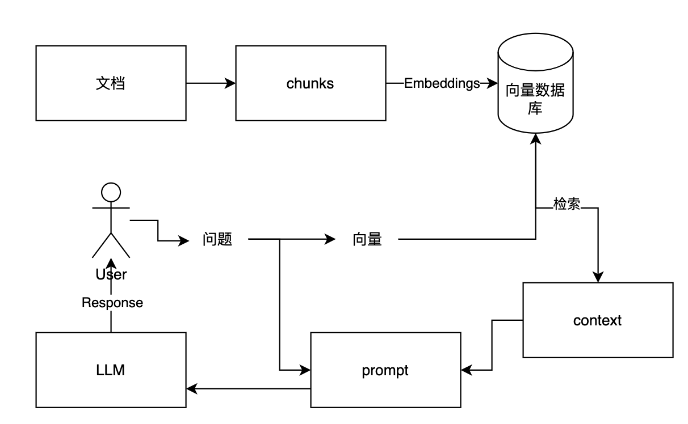
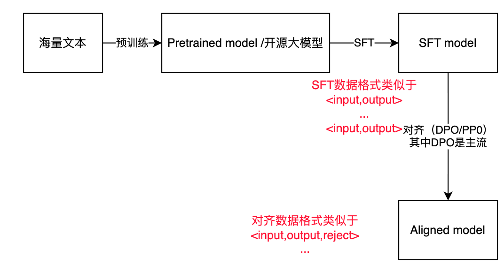
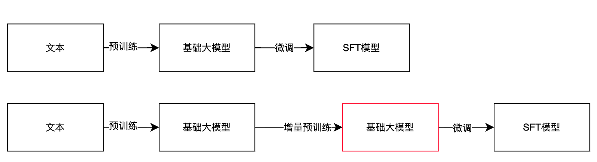
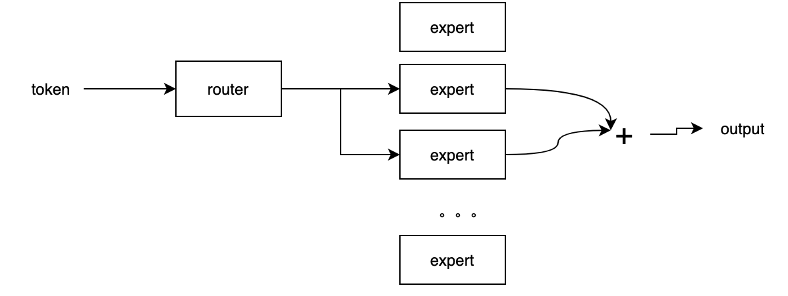

https://www.bilibili.com/video/BV1zm421G7hk/?spm_id_from=333.788&vd_source=fdc93e634b4e910d22dd9deb58914231


# 大模型科普

## RAG增强检索如何工作

## RAG流程



## RAG实战中常见问题

1. 文档处理（pdf，ppt，excel）
2. 如何划分chunks
3. embeddings的流程
4. 向量数据库的选择
5. 输入的问题需要预处理，扩充
6. 怎么进行合理的检索？
7. 获得的context，ranking的过程。就是精排
8. prompt如何设计
9. 使用怎么样的大模型，开源还是微调
10. 回复是否需要后处理，添加检查机制。 


## RAG结构问题和解决思路

> 【经典RAG结构的问题以及几点解决思路】 https://www.bilibili.com/video/BV124421Z71F/?share_source=copy_web&vd_source=bb1973c79c355011632db23f36a12ee0


切分过程中

- 动态切分
- 语义切分

向量化阶段

- 训练

提问问题阶段

- rewrite
- expansion

检索阶段

- rerank，在检索的过程后进行精排

- prompt compression


## 模型微调相关

**模型微调**：对于原有参数，添加改动量，即可获得新的参数。


### 全量微调

全部算<u>改动量</u>

### peft-Lora微调

针对改动量，其中信息有冗余。

参考<u>线性相关性</u>。

**<u>利用线性相关性来压缩数据量</u>**

详细看：https://www.bilibili.com/video/BV1tthPeFEWb/?spm_id_from=pageDriver&vd_source=fdc93e634b4e910d22dd9deb58914231
$$
w = A*B
$$

> w代表矩阵，其中还是**点乘**


## 向量数据库和文本检索速率

简单理解为，文本转换成向量后，和向量数据库里面的数据进行余弦相似度的比较，并返回多个top  n的向量数据库元数据，其中这一步的复杂度为`O(N) n代表向量数据库里面的个数`

余弦相似度的计算复杂度为`O(d) d代表向量的维度`

所以关键在于：如何降低复杂度和提高检索速率


## 大模型预训练和微调

微调分为两个阶段

- sft 阶段 =supervise fine tuning 指令微调

- 对齐阶段




## 灾难性遗忘

大模型会忘记之前的知识，

解决方法

- continue & pretrain 持续预训练
- finetune 微调 


以微调为例，减少遗忘方法

1. 不用管

2. 结合通用数据

   - 数据的配比

3. adapter插件，增加通用能力/ Models

   - lora 方法

     

4. regularation 正则方式

   - 使训练前后的矩阵的绝对值差值小于某个阈值

   - $$
     |w-w^0|<threshold
     $$

5. learning rate


## GraphRAG

传统的rag流程，针对某些的问题（下面会举例）表现时好时坏

问题如下：

1. xx产品的价值是什么？ = 微观问题

2. 去年技术团队的成功？ = 宏观问题
   - connecting the dot
   - 搭建知识图谱的过程，也可以理解为提前处理的过程

**graphRAG就是把海量的数据提前拿出来，并整理成知识图谱的过程**，在检索的过程中，只需要在图中找到某个特定节点去搜索即可/


**可能会遇到的问题**

1. 图谱构建，会有大量的冗杂信息，需要人工清洗
2. 计算点，耗费资源
3. 新的数据加入，可能要大改结构
4. ....


## 知识图谱和大模型关系

大模型幻觉是大模型落地最大阻碍

解决幻觉的方法

- llm能力
- 限制边界，通过llm并进行回复即可


这个边界怎么设置？

- 官方文档
- 企业文档
- 企业数据库

- 知识图谱（存储信息的方式）


知识图谱使用<u>**实体关系**</u>来存储信息的方法 

和其他文档的好处，优势

- 直观信息，通过关系体现
- 重要信息简单明了
- 。。。。（【什么是知识图谱？与大模型的关系是什么？】 https://www.bilibili.com/video/BV1gb421J72K/?p=23&share_source=copy_web&vd_source=bb1973c79c355011632db23f36a12ee0）


## 大模型幻觉是什么，为什么会产生幻觉 

大模型乱说=幻觉，产生例子

- 上下文矛盾 
- 与prompt要求不一致
- 与事实矛盾

- 荒谬回复


产生幻觉

- 数据质量

  - 不准确信息
  - 缺乏多样性数据 ， bias

- 训练过程

  - 过拟合
  - 微调没控制好

- 生成过程

  - 还是概率模型必定的

- 提升工程

  


## RAG和知识图谱结合 

neo4j的实现方式

【如何把RAG和知识图谱结合】 https://www.bilibili.com/video/BV15b42177cR/?share_source=copy_web&vd_source=bb1973c79c355011632db23f36a12ee0


## 经典RAG很难解决的问题以及Agent思路

> 【经典RAG很难解决的问题以及Agent思路】 https://www.bilibili.com/video/BV1vPHMefEtn/?share_source=copy_web&vd_source=bb1973c79c355011632db23f36a12ee0


1. 文档总结 Summarization of documents 

   - Iteradine , 文档迭代总结

   - 层次，Hierachical summarazation

2. 比较 Comparison

   - 比较A，B，C	
     - 抽取A，B，C信息 
     - 再总结

3. 语义搜索 + 统计 Semantic Search  + nl2sql

4. Complex Query(复杂问题)


以上问题都可以用agent来实现，agent搭建在rag上。


## 提示工程 VS RAG VS 微调

如何选择？

【通俗易懂理解提示工程、RAG和微调】 https://www.bilibili.com/video/BV1Ny411B7EK/?p=8&share_source=copy_web&vd_source=bb1973c79c355011632db23f36a12ee0


针对得到错误回复的情况有三个解决思路

1. 没问清楚

   提示工程

2. 缺乏相关知识

   rag相关

3. 能力不足

   涉及模型微调


## 什么是In-context learning

1. 不需要训练
2. 提供例子


## 什么是Continue Pretraining(增量预训练)?



什么时候做增量预训练

1. 基础模型支持Domain 和需要的domain相差较大
2. 语言不支持
3. 知识过期，需要进行更新

对数据和资源的要求较高


## ICL vs Finetune vs CPT 区别 

【In-context learning微调和增量预训练之间的区别】 https://www.bilibili.com/video/BV13g4ze9Ehn/?share_source=copy_web&vd_source=bb1973c79c355011632db23f36a12ee0


## 【模型微调】成本分析

模型微调的

- gpu成本

  - 训练7B模型使用一块GPU，几小时到几天不等

  - 65b

- 人力成本

  - 1-2人

- 推理成本

  - 暂不考虑

- 数据收集

  - 不确定性大，并且和业务紧密相关


如何计算gpu显存，在微调模型的时候

> https://www.bilibili.com/video/BV1g1421t7dP/?spm_id_from=pageDriver&vd_source=fdc93e634b4e910d22dd9deb58914231

全量微调是

model size * 12 = 

高效微调（peft）

- qlora（更节省显存）
- lora


## 大模型-> AGI？

走不了，


## 大模型benchmark的重要性

benchmark = 评测集

对于产品经理来说，benchmark可以定义

- 成功标准
- 是否上线？距离上线的差距

对于工程师来说，benchmark定义

- 是否使用那个开源模型
- 如何选择数据

谁来说，这个评测集

- 一般都是产品经理


## 大模型如何产生回复

概率模型，回复有不可控的特点


## Topk，topP

topk，前k个概率最大的选择

topp，阈值概率大于topp


## rag&微调的选择

大模型项目选择RAG还是微调：八个判断依据

1. 动态数据， === RAG
2. 模型能力控制  === 微调
3. 幻觉 === RAG>微调
4. 可解释性：=== RAG
5. 成本：===RAG
6. 依赖通用能力 ===RAG
7. 延迟： ===微调
8. 智能设备 ： === 微调


实际场景下的示范

- 投资理财规划师

  rag

  - 处理动态数据
  - 很强对话能力
  - 金融能力

- 金融信息抽取bot

  微调

  - 很强的抽取能力
  - 金融能力

- 销售机器人

  rag+微调

  - 产品数据
  - 销售技巧/语气


## What is RLHF

人类反馈强化学习


## What is MoE

  Mixture of Experts （MOE）




## 自注意力机制

self-attention

【通俗易懂理解自注意力机制（Self-Attention）】 https://www.bilibili.com/video/BV1sw4m1k7Gt/?share_source=copy_web&vd_source=bb1973c79c355011632db23f36a12ee0

transformers最大的缺点，是推理成本较高


## Llama 3.1 总计

llama 3.1 特点

- 最大，最有效有405亿个参数
- 8b，70b，128k上下文
- 技术报告：透露数据细节

llama 3.1 成功原因

- 模型大小：scaling law
- 数据大小：15t数据
- 数据上的工作
  - 数据情况，构造，配比
- 结构 并没有太大改变
- 定向能力的提升


<u>**scaling laws**</u>

- 模型大小
- 数据量
- 计算量 


## 模型量化&蒸馏

量化和蒸馏都是模型压缩的一种


**<u>量化 - Quantization</u>**

降低参数的精度， 节省空间和提高速度

```
float32 = 32bits/bytes 
|||||
float16/int8 = 
```

蒸馏 - 模仿

大模型变小模型

teacher model - > student model 


## 模型泛化

举一反三 ， generalization


## 大模型落地5坑

1. 寻找场景，理解技术边界 === 产品第一负责人
2. pmf阶段靠别人不如靠自己 == pmf 产品和市场契合度
3. 考虑清楚壁垒
4. 用最好模型的mvp开发 ， 
5. 不要强调技术

### 从技术可行性剖析AI搜索场景的可落地性

大模型擅长

- 理解能力/总结 <u>**AI搜索**</u>
- 信息提取能力<u>**AI搜索**</u>
- 创意生成

不擅长

- 专业深度
- 稳定/安全
- 推理 


### 传统AI和大模型AI区别 

>  https://www.bilibili.com/video/BV1ATiue2Eza/?share_source=copy_web&vd_source=bb1973c79c355011632db23f36a12ee0

 传统AI  = AI 1.0 

大模型AI = AI 2.0


### 大模型未来发展

- 回归理性
- 大部分是pmf阶段
- 模型能力变强
- 多模态
- 小模型
- 模型优化
- 大模型安全
- 智能体agent


## 端到端模型

好处

- latency 延迟低
- performance ， 效果好 
- 灵活性

坏处

- 训练难度大
- 解释性差


## 为什么需要Agent

【为什么需要智能体（Agent）】 https://www.bilibili.com/video/BV1gg4ze9EBh/?share_source=copy_web&vd_source=bb1973c79c355011632db23f36a12ee0

